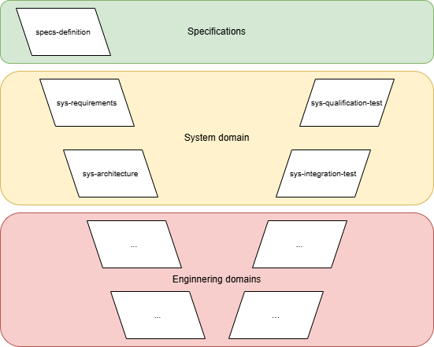

# Development methodology overview

## Purpose

This document defines the development methodology adopted by Embedded C Workbench based on a V-model approach.

## Glossary

| Term | Definition |
|---|---|
| spec | Abbreviation of specifications used in naming conventions. |
| sys | Abbreviation of the system domain used in naming conventions. |
| sw | Abbreviation of the software domain used in naming conventions. |
| hw | Abbreviation of the hardware domain used in naming conventions. |

## V-model overview

The V-model defines a structure where:
- Development processes are defined on the left side of the "V"
- Validation processes on the right side of the "V" verify the implementation against the processes at the same level on the opposite side of the "V"



Each process produces defined work products that serve as input to subsequent processes, maintaining traceability between them.

The development flow is organized across the following domains:
- Specifications domain: Defines V-model inputs derived from stakeholder specifications.
- System domain: Defines and validates the system based on specifications.
- Engineering domains (one or more depending on system needs): Define and validate domain-specific implementations based on the system domain (e.g., software, hardware, ...). Engineering domains are typically developed in parallel. However, dependencies between domains may define a prioritized execution flow when required. For example:
  - Software domain may depend on hardware domain for low-level drivers or hardware interfaces.
  - Hardware domain may depend on mechanical constraints to define PCB dimensions.

This methodology enforces a structured flow, establishing full traceability from system requirements down to engineering domains implementation and back to system-level validation, ensuring that all requirements are consistently implemented and validated.

## Specifications

See [specifications overview](specifications/specifications_overview.md).

## Engineering domains

### System domain

See [system domain overview](system_domain/system_domain_overview.md).

### Software domain

See [software domain overview](software_domain/software_domain_overview.md).

### Hardware domain

See [hardware domain overview](hardware_domain/hardware_domain_overview.md).

## Work products organization

The workspace shall be organized by domain. Each domain shall have a dedicated folder containing the work products generated for that domain. The workspace folder structure shall be as follows:

```text
spec/
sys/
sw/
hw/
```

Additional folders may exist anywhere in the workspace that are not part of the defined work products organization. These folders may be used to support implementation or project-specific needs. The defined structure establishes the minimum organization required to locate work products unambiguously.