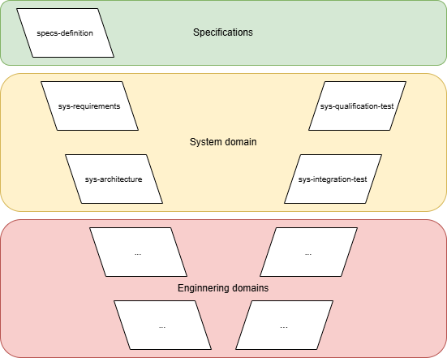
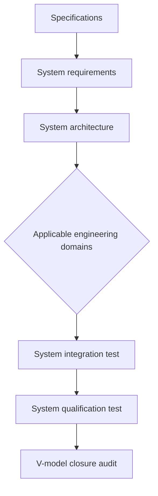

# Development methodology overview

## Purpose

This document defines the development methodology adopted by [Embedded Workbench](../ew.md) based on a V-model approach.

## Glossary

| Term | Definition |
|---|---|
| spec | Abbreviation of specifications used in naming conventions. |
| sys | Abbreviation of the system domain used in naming conventions. |
| sw | Abbreviation of the software domain used in naming conventions. |
| hw | Abbreviation of the hardware domain used in naming conventions. |

## V-model overview

The V-model defines a structure where:
- Development processes are defined on the left side of the "V"
- Validation processes on the right side of the "V" verify the implementation against the processes at the same level on the opposite side of the "V"



Each process produces defined work products that serve as input to subsequent processes, maintaining traceability between them.

The development flow is organized across the following domains:
- Specifications domain: Defines V-model inputs derived from stakeholder specifications.
- System domain: Defines and validates the system based on specifications.
- Engineering domains (one or more depending on system needs): Define and validate domain-specific work products based on the system domain (e.g., software, hardware, ...). Engineering domains are typically developed in parallel. However, dependencies between domains may define a prioritized execution flow when required; for example, the software domain may depend on the hardware domain for low-level drivers or hardware interfaces.

Not all engineering domains shall apply to all projects.

The applicable engineering domains shall be determined from the system needs.

Work products belonging to engineering domains that do not apply to the project shall not be considered part of the project development scope and shall not be expected as required inputs to downstream processes.

This methodology enforces a structured flow, establishing full traceability from system requirements down to engineering domain work products and back to system-level validation, ensuring that all requirements are consistently addressed and validated.

## V-model workflow

The complete flow of a V-model milestone is defined as follows:
- [Specifications](#specifications)
- System requirements. See [System domain](#system-domain)
- System architecture. See [System domain](#system-domain)
- Complete each applicable engineering domain according to its defined processes. When multiple engineering domains apply, the preferred execution order is:
  1. [Hardware domain](#hardware-domain)
  2. [Software domain](#software-domain)
- System integration test. See [System domain](#system-domain)
- System qualification test. See [System domain](#system-domain)
- V-model closure audit


```mermaid
flowchart TD
    A[Specifications] --> B[System requirements]
    B --> C[System architecture]
    C --> D{Applicable engineering domains}
    D --> SIT[System integration test]
    SIT --> SQT[System qualification test]
    SQT --> AUDIT[V-model closure audit]
```

Each V-model process that has a corresponding domain review shall be followed by that review before that process is considered closed. In addition, as indicated by the flow, a final V-model closure audit shall be performed once all processes are considered complete for a given milestone, in order to formally close it.

Milestones define small, self-contained, functionally meaningful groups of specifications. When practical, a larger number of smaller milestones should be preferred over a smaller number of larger milestones.

Each V-model iteration shall be scoped to a single milestone. Only specifications assigned to that milestone, shall be considered in scope.

The V-model may be entered at any point where the relevant upstream work products already exist. It is not required to start at the top-V process for every iteration. When modifying mid-V process work products, the flow shall continue through the remaining applicable processes to preserve the integrity and coherence of all applicable V-model work products.

## Specifications

See [specifications overview](specifications/specifications_overview.md).

## Engineering domains

### System domain

See [system domain overview](system_domain/system_domain_overview.md).

### Software domain

See [software domain overview](software_domain/software_domain_overview.md).

### Hardware domain

See [hardware domain overview](hardware_domain/hardware_domain_overview.md).

## Work products organization

The workspace shall be organized by domain.

Each applicable engineering domain shall have a dedicated folder containing the work products generated for that domain.

The workspace folder structure shall be as follows when all engineering domains apply:

```text
spec/
sys/
sw/
hw/
```

Additional folders may exist anywhere in the workspace that are not part of the defined work products organization. These folders may be used to support implementation or project-specific needs. The defined structure establishes the minimum organization required to locate work products unambiguously.

## Resources

- Requirements definition. See [resources/requirements_definition.md](resources/requirements_definition.md).
- Architecture definition. See [resources/architecture_definition.md](resources/architecture_definition.md).
- Cross-domain interface definition. See [resources/cross_domain_interface_definition.md](resources/cross_domain_interface_definition.md).
- Python coding guidelines. See [resources/python_coding_guidelines.md](resources/python_coding_guidelines.md).
- Embedded target remote logic analyzer. See [resources/embedded_target_remote_logic_analyzer.md](resources/embedded_target_remote_logic_analyzer.md).
