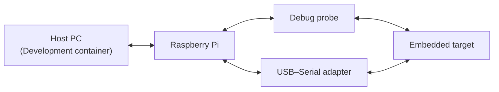

# Embedded C Workbench (ECW) overview

ECW is a template for embedded C projects designed around a dual-targeting approach, allowing hardware-independent code to run on both host and embedded systems. It provides a fully containerized development environment with all dependencies preinstalled enabling fast setup, reproducible builds, and Software-in-the-Loop (SiL) capabilities.

Debugging, logging, and any interaction that requires access to the embedded target are routed through a Raspberry Pi acting as a hardware abstraction gateway. The Raspberry Pi runs a frozen reproducible SD image and exposes standardized interfaces to the development container enabling repeatable environments, Hardware-in-the-Loop (HiL) capabilities and low-cost remote target access. See [raspberry_pi_setup.md](technical_notes/raspberry_pi_setup.md) for the required Raspberry Pi configuration.

The following diagram illustrates the expected hardware setup and communication architecture between the host environment and the embedded target.

ECW includes:

- Ubuntu 24.04–based devcontainer. See [.devcontainer](../.devcontainer/) folder.
- Preconfigured VS Code environment template. See [.vscode](../.vscode/) folder.
- AI-assisted development workflow based on OpenCode and Gentle AI Stack. See [ai_assisted_development.md](technical_notes/ai_assisted_development.md). xxxyyy TODO documentar mes extensament com s'integra la IA , V-model, domains... revisar document al que fa referencia i actualitzar
- Automated [embedded target remote debugging](technical_notes/embedded_target_remote_debugging.md) via GDB server.
- Automated [embedded target remote logging](technical_notes/embedded_target_remote_logging.md) via serial-to-TCP bridge.
- Automated [embedded target remote HiL testing](technical_notes/embedded_target_remote_HiL_testing.md) via CTest.
- GCC toolchains for host and ARM embedded target builds. See [toolchains](../tools/cmake/toolchains/) folder.
- CMake functions and scripts to automate the build process. See [cmake/functions](../tools/cmake/functions/) and [tasks](../.vscode/tasks/) folders.
- Automated source formatting for C/C++ (`clang-format`) and assembler ([asm_format.py](../tools/scripts/asm_format.py)).
- [Embedded C coding guidelines](embedded_c_coding_guidelines/embedded_c_coding_guidelines.md).
- [Python template](python_coding_guidelines/template.py) used for verification, scripting, and environment setup within the project.
- Technical notes related to embedded systems. See [technical_notes](technical_notes/) folder.

All user-configurable settings of the template are exposed through environment variables defined in the [devcontainer.json](../.devcontainer/devcontainer.json) file. The template values are defined as follows:

- Host-defined environment variables (`"${localEnv:ENV_VAR}"`): Used for setup-specific or private configurations. These environment variables shall be defined in the host environment and will be automatically available inside the container.
- Default environment variables: Used for project-specific configuration with common default values. These can be modified directly in [devcontainer.json](../.devcontainer/devcontainer.json) if required.
- Empty environment variables: Used for project-specific configuration where no default value is possible. These shall be set directly in [devcontainer.json](../.devcontainer/devcontainer.json).

# Glossary

| Term | Definition |
|------|------------|
| SiL (Software-in-the-Loop) | Execution of embedded software in a host environment without real embedded target hardware. |
| HiL (Hardware-in-the-Loop) | Execution of embedded software on real embedded target hardware integrated into an automated workflow. |
| Dual-target | Capability to execute hardware-independent code on both host and embedded targets. |

# Usage example

@todo Add a step-by-step guide describing the initial setup of this template for a new project.

@todo Add a guide explaining how to update an existing project to a newer version of this template (by adding the template as a remote).

@todo Add AI-based peer review using embedded_c_coding_guidelines as input.

@todo Add automated fuzz testing.

@todo Add a linter.
