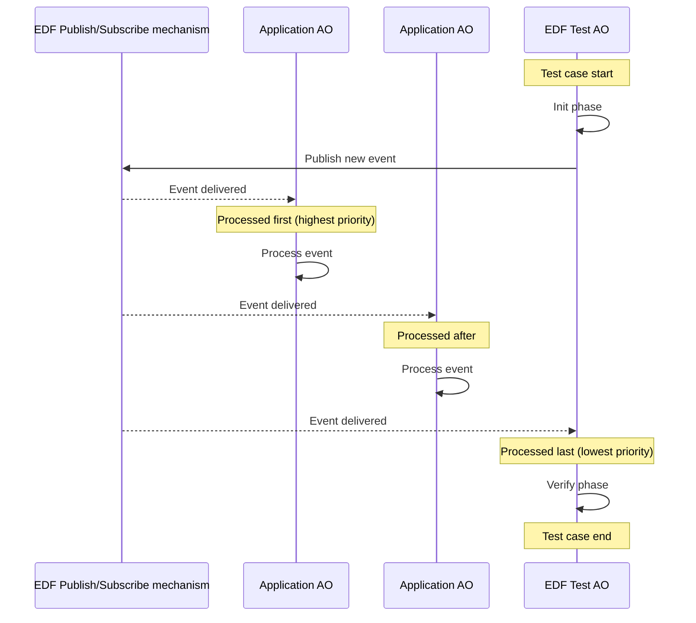

# Event Driven Framework Test (EDF_Test) overview

EDF_Test is a lightweight, platform-agnostic testing framework designed to run on both embedded systems and host environments, specifically tailored for validating event-driven systems built on top of [EDF](../../doc/edf.md). It enables deterministic and non-intrusive validation of applications based on inversion of control, where the framework owns the main execution loop and never returns control.

Conventional testing approaches are not suitable for the inversion of control execution model, as the execution flow is not based on sequential call-and-return semantics and cannot be tested using standard unit test runners. Existing alternatives typically rely on extensive logging and external analysis tools, which introduce significant maintenance overhead and pollute the source code with test-only instrumentation. EDF_Test addresses this limitation by integrating testing directly into the [EDF](../../doc/edf.md) execution model.

EDF_Test introduces a dedicated Active Object (AO) with the lowest system priority, reserved for testing purposes. The user is expected to reserve the lowest available AO priority when enabling this testing mode. This test AO is subscribed by default to all system events and is guaranteed to be the last AO to process them. As a result, minimal intrusiveness is ensured, since event processing by application AOs is completed first (guaranteed by [EDF](../../doc/edf.md) priority-based scheduling) and the test logic is executed only after all functional behavior has finished.

Each test case is composed of two phases:
- Init: The test prepares the system with the desired initial conditions and then stimulates it by publishing the event that triggers the behavior under test.
- Verify: Once all other AOs have processed the init event and any subsequent events derived from it, the test AO is invoked, with the verification phase bound exclusively to a specific event, and executes the validation logic using the built-in macros. After verification, the framework automatically proceeds to the init phase of the next test case.

This approach enables fully automated, in-system testing within a single self-contained executable, without modifying application logic, relying on external tools, or introducing intrusive logging, while preserving real execution behavior and timing characteristics.

The ECF framework provides CMake functions that encapsulate test executable creation and registration with CTest. See [ECF cmake functions](../../../tools/cmake/functions/ecf_test.cmake)

# Glossary

| Term | Definition |
|------|------------|
| @todo |   |

# Usage example

@todo